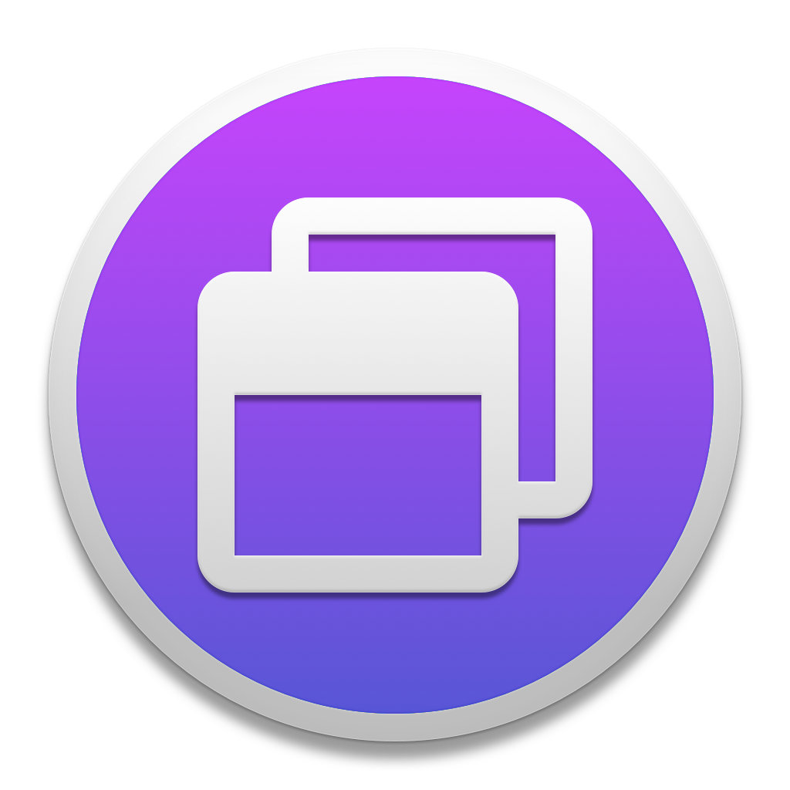

# Desktop Profiles

The main objective of this app is to make easier transitions between different work environments. As a user, you can predefine any number of profiles which stores data about system settings such as dark mode, accent colour, night shift but also apps internal states and window arrangments.

## Demo

Profiles can for example control system theme and can be invoked by a keyboard shortcut.
  

Profiles save the layout of applications windows and the internal state of individual windows. 
